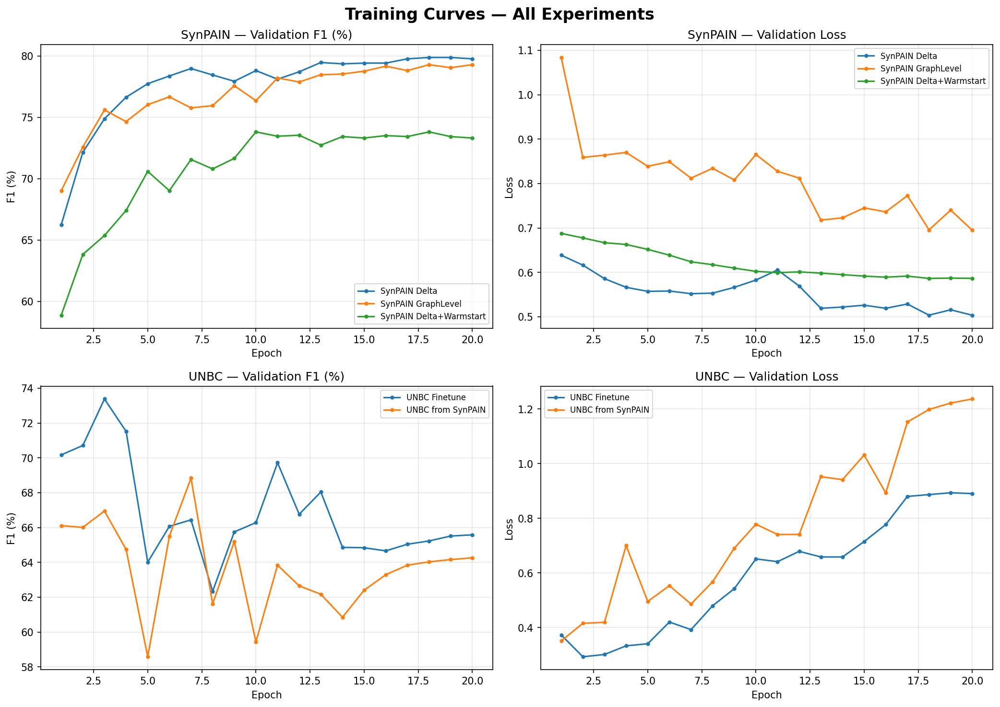
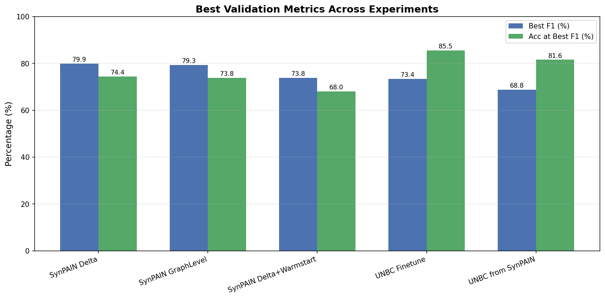
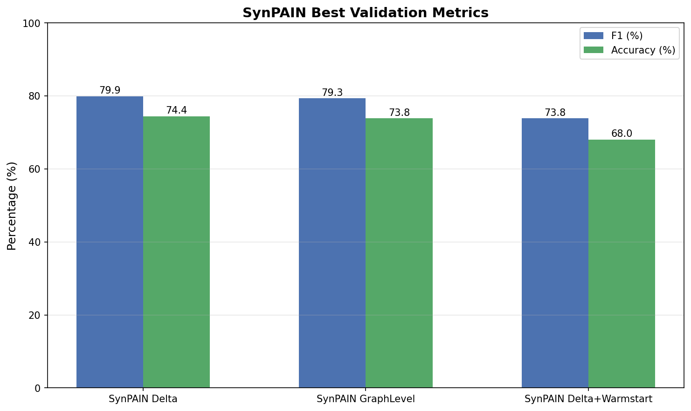
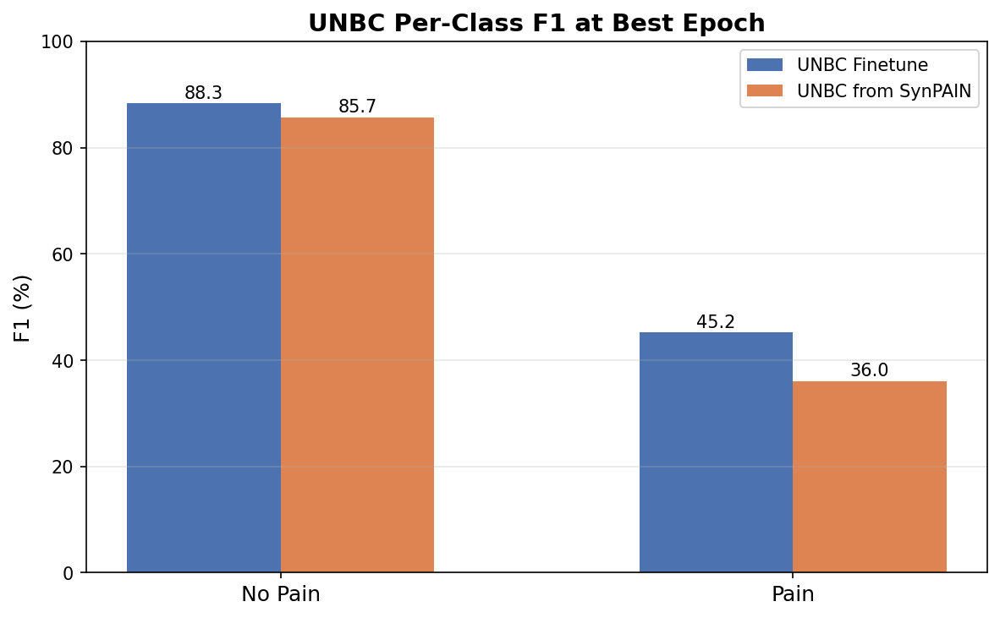
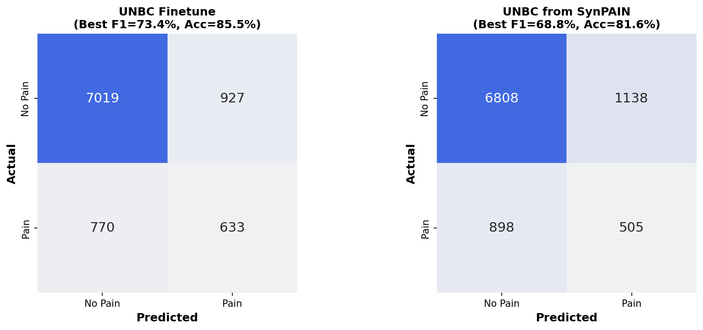
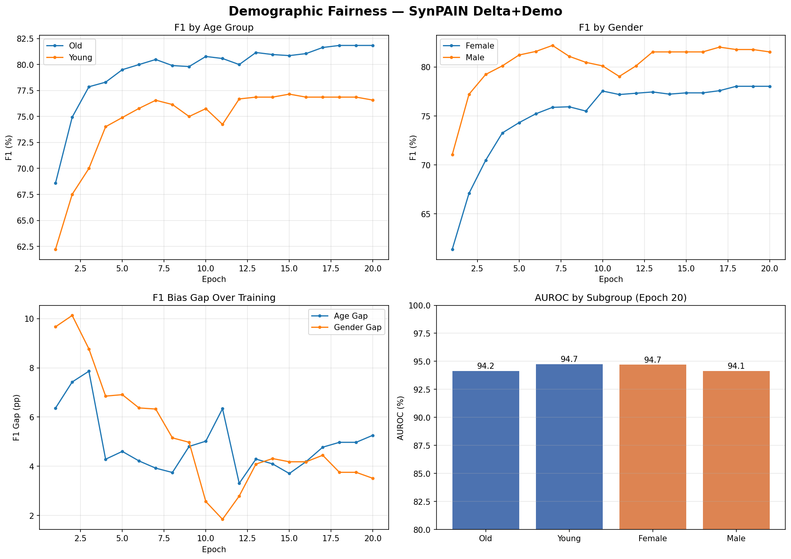

# GraphAU-Pain Extension — Experiment Summary

## Overview

This document summarizes the results of all extension experiments:

- **SynPAIN pretraining** (3 variants): Delta graph, Graph-level, Delta+Warmstart
- **SynPAIN with demographics**: Delta graph + demographic fairness evaluation
- **UNBC finetuning** (2 variants): Direct finetune, Transfer from SynPAIN

## SynPAIN Pretraining Results

| Experiment | Best F1 (%) | Best Acc (%) | Best Epoch | Architecture |
|---|---|---|---|---|
| SynPAIN Delta | **79.88** | 74.39 | 18 | Swin-Base |
| SynPAIN GraphLevel | **79.29** | 73.83 | 18 | Swin-Base |
| SynPAIN Delta+Warmstart | **73.81** | 68.04 | 10 | Swin-Base |

**Key findings:**
- Delta graph (node-level subtraction) achieves the best F1 of **79.88%**, outperforming graph-level (79.29%)
- Warmstart from UNBC stage-1 hurts SynPAIN performance (73.81%), likely due to domain gap between real UNBC and synthetic SynPAIN data
- Delta vs GraphLevel improvement: +0.59 pp F1

## UNBC Pain Estimation Results (Binary: Pain vs No Pain)

| Experiment | Best F1 (%) | Best Acc (%) | Best Epoch | Architecture |
|---|---|---|---|---|
| UNBC Finetune | **73.38** | 85.52 | 3 | ResNet-50 |
| UNBC from SynPAIN | **68.84** | 81.60 | 7 | ResNet-50 |

### Per-Class F1 at Best Epoch

| Experiment | No Pain F1 (%) | Pain F1 (%) |
|---|---|---|
| UNBC Finetune | 88.3 | 45.2 |
| UNBC from SynPAIN | 85.7 | 36.0 |

**Key findings:**
- Direct UNBC finetuning achieves best F1 of **73.38%** (epoch 3)
- Transfer from SynPAIN does not improve UNBC results (best 68.84%), suggesting domain gap between synthetic and real data
- Both models show significant class imbalance: No Pain F1 >> Pain F1
- Early stopping is important: both models overfit after epoch 3-7

## Demographic Fairness Analysis (SynPAIN Delta+Demo)

### Best Epoch (18) — Subgroup Performance

| Group | Subgroup | N | AUROC | F1 | Balanced Acc |
|---|---|---|---|---|---|
| Age Group | Old | 319 | 94.0 | 81.8 | 74.6 |
| Age Group | Young | 216 | 94.6 | 76.9 | 72.3 |
| Gender | Female | 276 | 94.7 | 78.0 | 72.8 |
| Gender | Male | 259 | 93.9 | 81.8 | 74.6 |

### Bias Gaps at Best Epoch

| Dimension | F1 Gap (pp) | AUROC Gap (pp) | Balanced Acc Gap (pp) |
|---|---|---|---|
| Age Group | 4.97 | 0.54 | 2.35 |
| Gender | 3.76 | 0.78 | 1.71 |

**Key findings:**
- Gender bias gap narrows from **9.67 pp** (epoch 1) to **3.76 pp** (epoch 18) in F1
- Age bias gap narrows from **6.36 pp** (epoch 1) to **4.97 pp** (epoch 18) in F1
- Male subgroup slightly outperforms Female (F1: 81.8% vs 78.0%)
- Old subgroup slightly outperforms Young (F1: 81.8% vs 76.9%)
- AUROC is high across all subgroups (93.9-94.7%), indicating good ranking ability

## Plots

### Training Curves

### Best Metrics Comparison

### SynPAIN Metrics Comparison

### UNBC Per-Class F1

### Approximate Confusion Matrices (UNBC)

### Demographic Fairness

