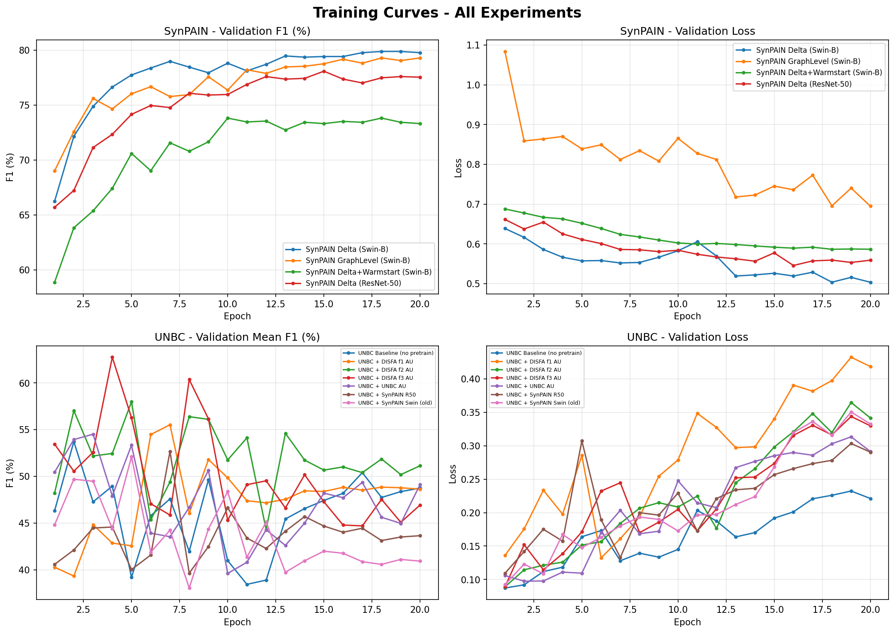
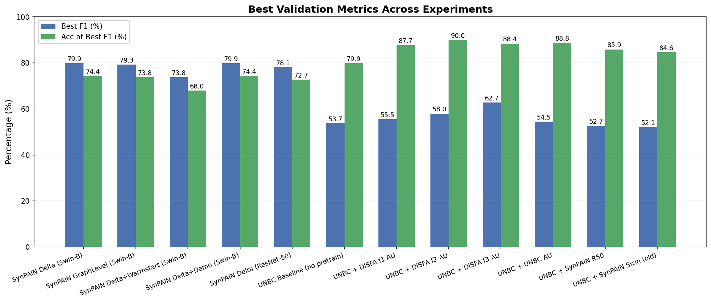
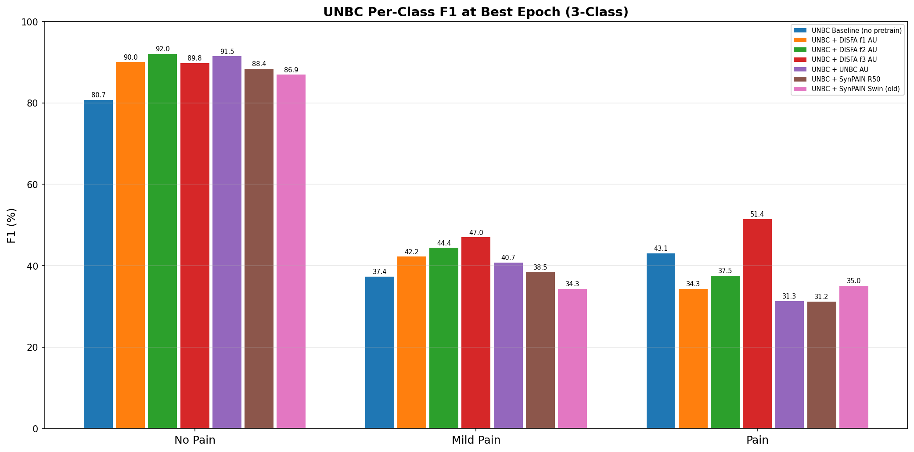
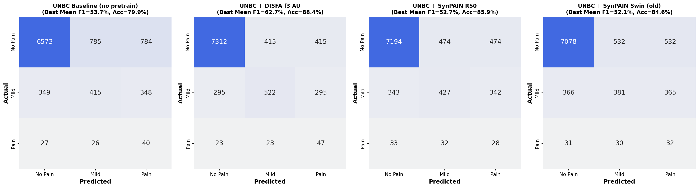
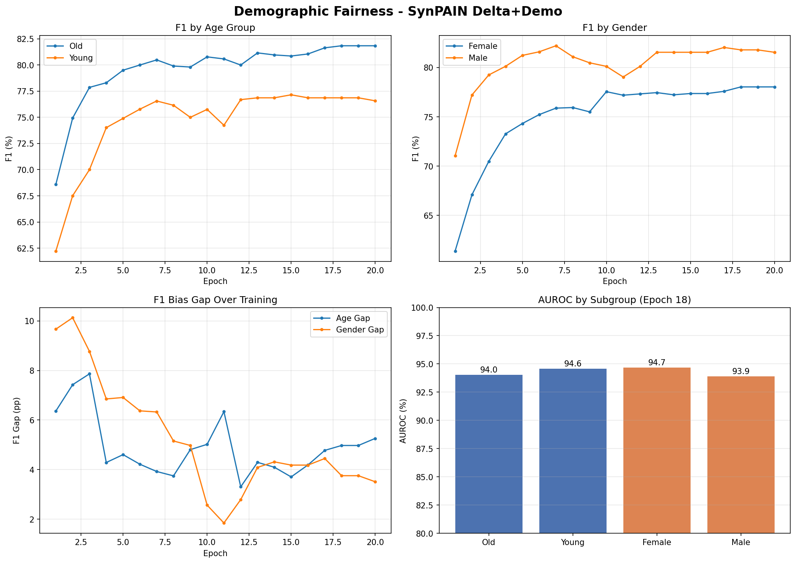

# GraphAU-Pain Extension - Experiment Summary

## Overview

This document summarizes the results of all extension experiments:

- **SynPAIN pretraining** (3 variants): Delta graph, Graph-level, Delta+Warmstart
- **SynPAIN with demographics**: Delta graph + demographic fairness evaluation
- **UNBC finetuning** (7 variants, 3-class): Baseline, DISFA AU (3 folds), UNBC AU, SynPAIN R50, SynPAIN Swin

## SynPAIN Pretraining Results (Binary: Pain vs No Pain)

| Experiment | Best F1 (%) | Best Acc (%) | Best Epoch |
|---|---|---|---|
| SynPAIN Delta (Swin-B) | **79.88** | 74.39 | 18 |
| SynPAIN GraphLevel (Swin-B) | **79.29** | 73.83 | 18 |
| SynPAIN Delta+Warmstart (Swin-B) | **73.81** | 68.04 | 10 |
| SynPAIN Delta (ResNet-50) | **78.08** | 72.71 | 15 |

**Key findings:**
- SynPAIN Delta (Swin-B): best F1 = **79.88%** (epoch 18)
- SynPAIN GraphLevel (Swin-B): best F1 = **79.29%** (epoch 18)
- SynPAIN Delta+Warmstart (Swin-B): best F1 = **73.81%** (epoch 10)
- SynPAIN Delta (ResNet-50): best F1 = **78.08%** (epoch 15)
- Warmstart from UNBC stage-1 hurts SynPAIN performance, likely due to domain gap between real UNBC and synthetic SynPAIN data
- Swin-Base outperforms ResNet-50 on SynPAIN Delta task

## UNBC Pain Estimation Results (3-Class: No Pain / Mild Pain / Pain)

| Experiment | Best Mean F1 (%) | Best Acc (%) | Best Epoch | Architecture |
|---|---|---|---|---|
| UNBC Baseline (no pretrain) | **53.71** | 79.87 | 2 | ResNet-50 |
| UNBC + DISFA f1 AU | **55.51** | 87.71 | 7 | ResNet-50 |
| UNBC + DISFA f2 AU | **57.98** | 89.97 | 5 | ResNet-50 |
| UNBC + DISFA f3 AU | **62.74** | 88.41 | 4 | ResNet-50 |
| UNBC + UNBC AU | **54.50** | 88.78 | 3 | ResNet-50 |
| UNBC + SynPAIN R50 | **52.66** | 85.87 | 7 | ResNet-50 |
| UNBC + SynPAIN Swin (old) | **52.10** | 84.60 | 5 | ResNet-50 |

### Per-Class F1 at Best Epoch

| Experiment | No Pain F1 (%) | Mild Pain F1 (%) | Pain F1 (%) |
|---|---|---|---|
| UNBC Baseline (no pretrain) | 80.7 | 37.4 | 43.1 |
| UNBC + DISFA f1 AU | 90.0 | 42.2 | 34.3 |
| UNBC + DISFA f2 AU | 92.0 | 44.4 | 37.5 |
| UNBC + DISFA f3 AU | 89.8 | 47.0 | 51.4 |
| UNBC + UNBC AU | 91.5 | 40.7 | 31.3 |
| UNBC + SynPAIN R50 | 88.4 | 38.5 | 31.2 |
| UNBC + SynPAIN Swin (old) | 86.9 | 34.3 | 35.0 |

**Key findings:**
- UNBC Baseline (no pretrain): best mean F1 = **53.71%** (epoch 2)
- UNBC + DISFA f1 AU: best mean F1 = **55.51%** (epoch 7)
- UNBC + DISFA f2 AU: best mean F1 = **57.98%** (epoch 5)
- UNBC + DISFA f3 AU: best mean F1 = **62.74%** (epoch 4)
- UNBC + UNBC AU: best mean F1 = **54.50%** (epoch 3)
- UNBC + SynPAIN R50: best mean F1 = **52.66%** (epoch 7)
- UNBC + SynPAIN Swin (old): best mean F1 = **52.10%** (epoch 5)
- **Best overall**: UNBC + DISFA f3 AU (62.74%)
- DISFA AU pretraining provides the largest boost; fold 3 yields the best results
- SynPAIN pretraining (both R50 and Swin) degrades performance vs baseline — synthetic-to-real domain gap
- Pain class is hardest to classify (lowest F1), followed by Mild Pain
- Class imbalance is severe: No Pain dominates both in data and metrics

### Comparison with Paper (arxiv:2505.19802)

| Source | No Pain F1 (%) | Mild Pain F1 (%) | Pain F1 (%) | Mean F1 (%) | Acc (%) |
|---|---|---|---|---|---|
| Paper (Table 3) | 93.1 | 51.2 | 54.3 | 66.21 | 87.61 |
| Our Best (UNBC + DISFA f3 AU) | 89.8 | 47.0 | 51.4 | 62.74 | 88.41 |

**Gap analysis:** Our best (DISFA f3 AU pretrain) achieves ~62.7% vs paper's 66.2% mean F1.
Remaining ~3.5 pp gap likely due to: undersampling strategy, hyperparameter tuning, or data preprocessing differences.

## Demographic Fairness Analysis (SynPAIN Delta+Demo)

### Best Epoch (18) - Subgroup Performance

| Group | Subgroup | N | AUROC | F1 | Balanced Acc |
|---|---|---|---|---|---|
| Age Group | Old | 319 | 94.0 | 81.8 | 74.6 |
| Age Group | Young | 216 | 94.6 | 76.9 | 72.3 |
| Gender | Female | 276 | 94.7 | 78.0 | 72.8 |
| Gender | Male | 259 | 93.9 | 81.8 | 74.6 |

### Bias Gaps at Best Epoch

| Dimension | F1 Gap (pp) | AUROC Gap (pp) | Balanced Acc Gap (pp) |
|---|---|---|---|
| Age Group | 4.97 | 0.54 | 2.35 |
| Gender | 3.76 | 0.78 | 1.71 |

**Key findings:**
- Gender bias gap narrows from **9.67 pp** (epoch 1) to **3.76 pp** (epoch 18) in F1
- Age bias gap narrows from **6.36 pp** (epoch 1) to **4.97 pp** (epoch 18) in F1
- Male subgroup slightly outperforms Female (F1: 81.8% vs 78.0%)
- Old subgroup slightly outperforms Young (F1: 81.8% vs 76.9%)
- AUROC is high across all subgroups (93.9-94.7%), indicating good ranking ability

## Plots

### Training Curves

### Best Metrics Comparison

### UNBC Per-Class F1 (3-Class)

### Approximate Confusion Matrices (UNBC 3-Class)

### Demographic Fairness

