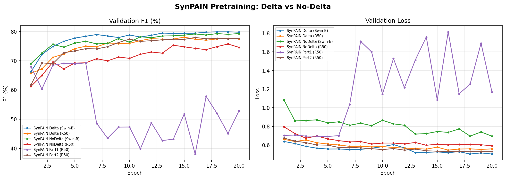
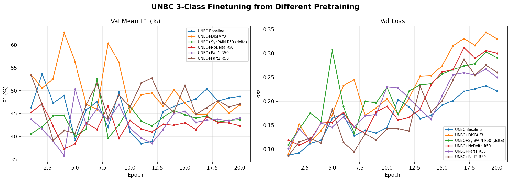
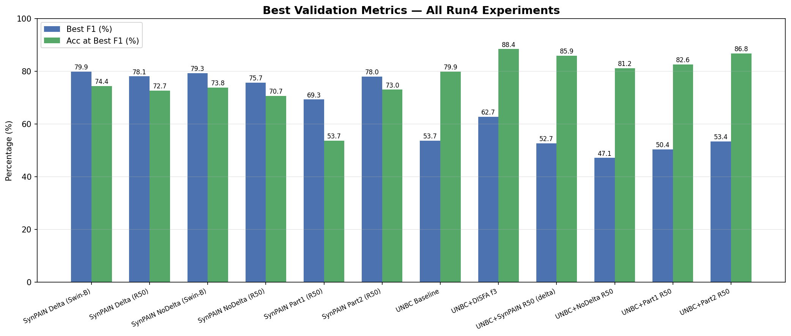
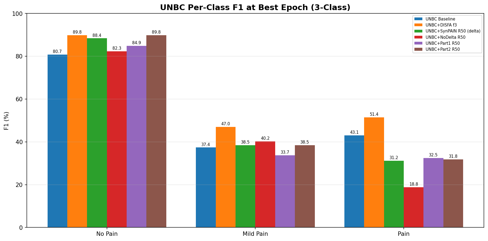
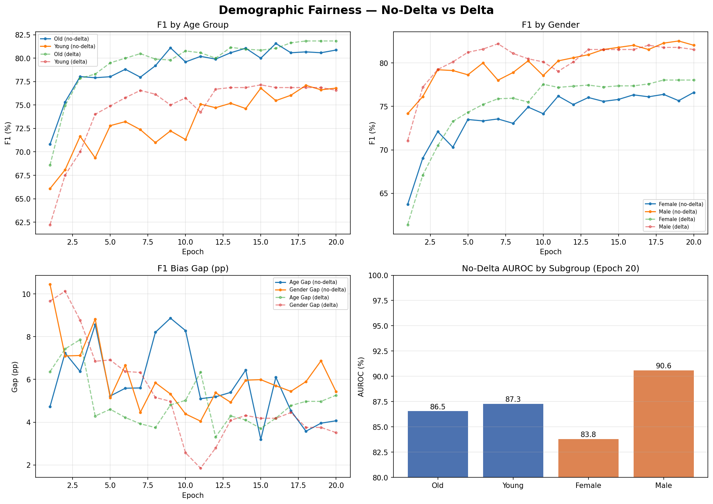

# Run 4: No-Delta & Part-Based Experiments

## Overview

This run investigates three questions:
1. **Does node-level delta matter?** Compare delta vs no-delta (graph-level) SynPAIN pretraining
2. **Does data composition matter?** Train on Part1-only (mostly pain) vs Part2-only (mostly no-pain)
3. **Demographic fairness without delta?** Compare bias gaps with vs without delta graph

## SynPAIN Pretraining Results

| Experiment | Best F1 (%) | Best Acc (%) | Best Epoch | Delta? |
|---|---|---|---|---|
| SynPAIN Delta (Swin-B) | **79.88** | 74.39 | 18 | Yes |
| SynPAIN Delta (R50) | **78.08** | 72.71 | 15 | Yes |
| SynPAIN NoDelta (Swin-B) | **79.29** | 73.83 | 18 | No |
| SynPAIN NoDelta (R50) | **75.73** | 70.65 | 19 | No |
| SynPAIN Part1 (R50) | **69.27** | 53.68 | 6 | Yes |
| SynPAIN Part2 (R50) | **77.97** | 73.02 | 16 | Yes |

**Key findings:**
- SynPAIN Delta (Swin-B): best F1 = **79.88%** (epoch 18)
- SynPAIN Delta (R50): best F1 = **78.08%** (epoch 15)
- SynPAIN NoDelta (Swin-B): best F1 = **79.29%** (epoch 18)
- SynPAIN NoDelta (R50): best F1 = **75.73%** (epoch 19)
- SynPAIN Part1 (R50): best F1 = **69.27%** (epoch 6)
- SynPAIN Part2 (R50): best F1 = **77.97%** (epoch 16)

## UNBC 3-Class Finetuning Results

| Experiment | Best F1 (%) | Best Acc (%) | Best Epoch |
|---|---|---|---|
| UNBC Baseline | **53.71** | 79.87 | 2 |
| UNBC+DISFA f3 | **62.74** | 88.41 | 4 |
| UNBC+SynPAIN R50 (delta) | **52.66** | 85.87 | 7 |
| UNBC+NoDelta R50 | **47.11** | 81.15 | 2 |
| UNBC+Part1 R50 | **50.35** | 82.62 | 5 |
| UNBC+Part2 R50 | **53.37** | 86.75 | 1 |

### Per-Class F1 at Best Epoch

| Experiment | No Pain F1 (%) | Mild Pain F1 (%) | Pain F1 (%) |
|---|---|---|---|
| UNBC Baseline | 80.7 | 37.4 | 43.1 |
| UNBC+DISFA f3 | 89.8 | 47.0 | 51.4 |
| UNBC+SynPAIN R50 (delta) | 88.4 | 38.5 | 31.2 |
| UNBC+NoDelta R50 | 82.3 | 40.2 | 18.8 |
| UNBC+Part1 R50 | 84.9 | 33.7 | 32.5 |
| UNBC+Part2 R50 | 89.8 | 38.5 | 31.8 |

**Key findings:**
- UNBC Baseline: best F1 = **53.71%** (epoch 2)
- UNBC+DISFA f3: best F1 = **62.74%** (epoch 4)
- UNBC+SynPAIN R50 (delta): best F1 = **52.66%** (epoch 7)
- UNBC+NoDelta R50: best F1 = **47.11%** (epoch 2)
- UNBC+Part1 R50: best F1 = **50.35%** (epoch 5)
- UNBC+Part2 R50: best F1 = **53.37%** (epoch 1)

## Demographic Fairness — No-Delta Swin-B

### Epoch 20 Subgroup Performance

| Group | Subgroup | N | AUROC | F1 | Balanced Acc |
|---|---|---|---|---|---|
| Age Group | Old | 319 | 86.5 | 80.9 | 73.4 |
| Age Group | Young | 216 | 87.3 | 76.8 | 72.7 |
| Gender | Female | 276 | 83.8 | 76.6 | 71.4 |
| Gender | Male | 259 | 90.6 | 82.0 | 75.0 |

### Bias Gaps

| Dimension | F1 Gap (pp) | AUROC Gap (pp) |
|---|---|---|
| Age Group | 4.07 | 0.72 |
| Gender | 5.43 | 6.80 |

## Plots

### SynPAIN Delta vs No-Delta

### UNBC Finetuning Comparison

### Best Metrics

### UNBC Per-Class F1

### Demographic Fairness

